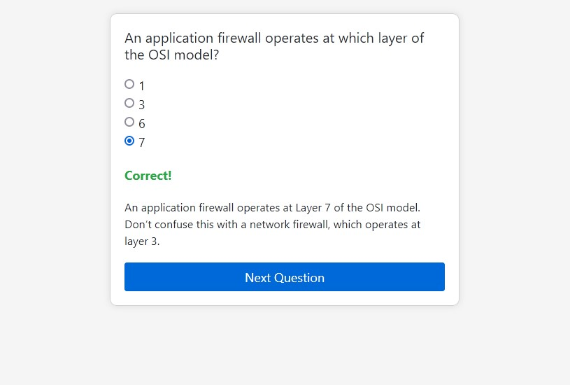

# Simple Practice Test Question App

A simple app in html/javascript which allows testing of practice test questions.

## Table of Contents

- [Features](#features)
- [Installation](#installation)
- [Usage](#usage)
- [License](#license)

## Features

A simple app which allows you to visualise practice questions, rather than just staring at a word document.

- Really simple, runs anywhere.
- Takes questions in a json format (questions.json)
- Provides correct or incorrect result
- Provides an explanation (if provided)
- Indicates correct answer if wrong one selected

## Installation

Simply clone the repo and serve with any web server you like. Python http.server works fine.

```bash
$ git clone https://github.com/duck-sec/Simple-Practice-Test-Question-App
$ cd Simple-Practice-Test-Question-App
$ python3 -m http.server 8080
```

## Usage

Modify the app to your own requirements, or use the simple JSON format from questions.json.

As configured, each question requires a question, answer options, solution (number) and an explanation, if you want to show one.

Drop your correctly formatted json into questions.json and navigate to your web server. 


